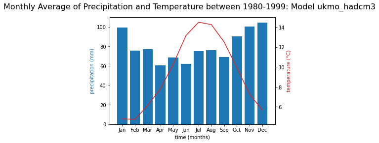

import matplotlib.pyplot as plt
from google.cloud import bigquery
import numpy as np

```python
#Initialise BigQuery Client
client = bigquery.Client()

# Query the Precipitation Dataset in BigQuery
query_string_precip = ("SELECT * FROM `wb_climate_data.wb_climate_precipitations` LIMIT 1 OFFSET 31 ")
query_job = client.query(query_string_precip)  # API request
rows = query_job.result()  # Waits for query to finish

# Query the Temperature Dataset in BigQuery
query_string_temp = ("SELECT * FROM `wb_climate_data.wb_climate_temperatures` LIMIT 1 OFFSET 30 ")
query_job = client.query(query_string_temp)  # API request
rows = query_job.result()  # Waits for query to finish
```


```python
#Create Data Frame with Precipitation and Temperature Data
df_precip = (client.query(query_string_precip).result().to_dataframe())
print(df_precip.head())
df_temp = (client.query(query_string_temp).result().to_dataframe())
print(df_temp.head())
```


```python
# Create x-axis Variables for Precipitations and Temperatures
x_axis=df_precip.columns[4:].tolist()

# Get Values for x-axis Variables
for index, rows in df_precip.iterrows():
    # Create list for the current row
    data_pre =[rows.Jan, rows.Feb, rows.Mar, rows.Apr, rows.May, rows.Jun, rows.Jul, rows.Aug, rows.Sep, rows.Oct, rows.Nov, rows.Dec]

#create x-axis variables for temperature
for index, rows in df_temp.iterrows():
    # Create list for the current row
    data_temp =[rows.Jan, rows.Feb, rows.Mar, rows.Apr, rows.May, rows.Jun, rows.Jul, rows.Aug, rows.Sep, rows.Oct, rows.Nov, rows.Dec]

```


```python
# Plot the data
fig, ax1 = plt.subplots()
fig.suptitle('Monthly Average of Precipitation and Temperature between 1980-1999: Model ukmo_hadcm3', fontsize=16)

color1 = 'tab:blue'
ax1.set_xlabel('time (months)')
ax1.set_ylabel('precipitation (mm)', color=color1)
ax1.bar(x_axis, data_pre, color=color1)

ax2 = ax1.twinx()

color2 = 'tab:red'
ax2.plot(x_axis, data_temp, color=color2)
ax2.set_ylabel('temperature (°C)', color=color2)
```





```python

```
