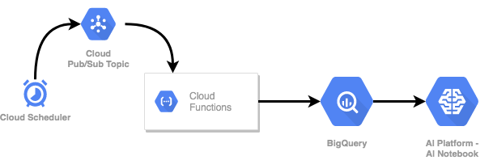

# E2E Analytics Pipeline
Created on the 3rd June 2020 during an AL Hack Day.

Data Source used: [The World Bank's Climate Data API](https://datahelpdesk.worldbank.org/knowledgebase/articles/902061-climate-data-api).

Here we create and end-to-end basic analytics pipeline on GCP. The image below demonstrates our infrastructure used.

Some of our infrastructure was created manually in the console, the following is a list of said resources:

1. Cloud Scheduler that points to a PubSub Topic
2. PubSub Topic that triggers a Cloud Function
3. Cloud Function (see `ingest.py`) that in a batch fashion populates Big Query with the data
4. AI Notebook (see `1980_WB_Climate_Data`) with code to illustrate our ingested data
